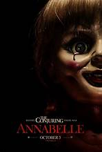
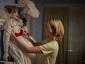
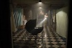
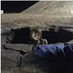

# 🩸 Annabelle 
+ Annabelle is a 2014 American supernatural horror film directed by John R. Leonetti, written by Gary Dauberman and produced by Peter Safran and James Wan.
---

 \

---
### Plot
---
 A husband and a wife are happily married and expecting a child. Mia (the wife) has to stay at home until the baby is delivered. Then, one night, when her husband came home from work, he brought home a present for his miserable wife. He brought home a doll named Annabelle, for her collection. Little do they know, the doll is possesed and is now a sinister presence lurking around their home.

#### [Back](./horror.md)