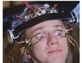
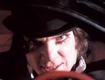
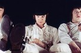

# 🍊 A Clockwork Orange 
>A Clockwork Orange is a 1971 dystopian crime film adapted, produced, and directed by Stanley Kubrick, based on Anthony Burgess's 1962 [novel](https://en.wikipedia.org/wiki/A_Clockwork_Orange_(novel)) of the same name. It employs disturbing, violent themes to comment on psychiatry, juvenile delinquency, youth gangs, and other social, political, and economic subjects in a dystopian near-future Britain.
---
![clockwork][def]\

---
 ### Plot
 ---
In a futuristic Britain, Alex DeLarge is the leader of a gang of "droogs": Georgie, Dim, and Pete. One night, after getting intoxicated, they engage in an evening of "ultra-violence", which includes beating a vagrant in the street, and a fight with a rival gang. They drive to the country home of writer Frank Alexander and trick his wife into letting them inside. They beat Alexander to the point of crippling him, and Alex violently rapes Alexander's wife while singing "Singin' in the Rain". The next day, while absent from school, Alex is approached by his probation officer, PR Deltoid, who is aware of Alex's activities and cautions him.

[def]: A_Clockwork.jpg