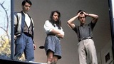

# 🚘 Ferris Bueller's Day Off

>+ A 1986 American teen comedy film written, co-produced, and directed by John Hughes.
---
\

---
### Plot
---
It tells the story of a high school slacker, Ferris, who skips school with his best friend Cameron and his girlfriend Sloane for a day in Chicago, regularly breaking the fourth wall to explain his techniques and inner thoughts.

#### [Back](./comedy.md)