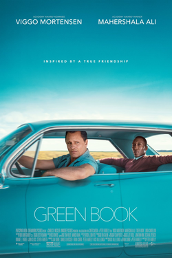

# 📗 Green Book   
>+ *Green Book* is a 2018 American biographical comedy-drama film directed by Peter Farrelly. Starring Viggo Mortensen and Mahershala Ali, the film is inspired by the true story of a 1962 tour of the Deep South by African American pianist Don Shirley and Italian American bouncer and later actor Frank "Tony Lip" Vallelonga.
---

---
### Plot 
---
In the Bronx in 1962, Italian American bouncer Tony Lip searches for new employment while the Copacabana is closed for renovations. He is invited to an interview with Dr. Don Shirley, an African American pianist in need of a driver for his eight-week concert tour through the Midwest and Deep South. Don hires Tony on the strength of his references. They embark with plans to return to New York City on Christmas Eve. Don's record label gives Tony a copy of The Negro Motorist Green Book, a guide for African American travelers to find motels, restaurants, and filling stations that would serve them in the Jim Crow South. 

#### [Back](./comedy.md)