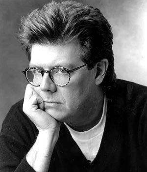

# John Hughes

>## Biography 
ohn Wilden Hughes Jr.[2] (February 18, 1950 – August 6, 2009) was an American film director, producer and screenwriter. He began his career in 1970 as an author of humorous essays and stories for the National Lampoon magazine. He went on in Hollywood to write, produce and direct some of the most successful live-action-comedy films of the 1980s and 1990s. He directed such films as Sixteen Candles, The Breakfast Club, Weird Science, Ferris Bueller's Day Off, Planes, Trains and Automobiles, She's Having a Baby, and Uncle Buck; and wrote the films National Lampoon's Vacation, Mr. Mom, Pretty in Pink, The Great Outdoors, National Lampoon's Christmas Vacation, Home Alone, Dutch, and Beethoven.

Most of Hughes' works were set in Chicago. He is best known for his coming-of-age teen comedy films with honest depictions of suburban teenage life. Many of his most enduring characters from these years were written for Molly Ringwald.[3] While out on a walk one morning in New York City in the summer of 2009, Hughes suffered a fatal heart attack.[1] His legacy after his death was honored by many, including at the 82nd Academy Awards by many actors he had worked with such as Ringwald, Matthew Broderick, Anthony Michael Hall, Chevy Chase, and Macaulay Culkin, among others.[4][5] Actors whose careers Hughes helped launch include Michael Keaton, Hall, Bill Paxton, Broderick, Culkin, and members of the Brat Pack group.

>## Filmography(full)
- National Lampoon's Class Reunion:1982
- Mr. Mom: 1983
- National Lampoon's Vacation: 1983
- Savage Islands: 1983
- Sixteen Candles: 1984
- The Breakfast Club: 1985
- National Lampoon's European Vacation: 1985
- Weird Science: 1985
- Pretty in Pink: 1986
- Ferris Bueller's Day Off: 1986
- Some Kind of Wonderful: 1987
- Planes, Trains and Automobiles: 1987
- She's Having a Baby: 1988
- The Great Outdoors: 1988
- Uncle Buck: 1989
- National Lampoon's Christmas Vacation: 1989
- Home Alone: 1990
- Career Opportunities: 1991
- Only the Lonely: 1991
- Dutch: 1991
- Curly Sue: 1991
- Beethoven: 1992
- Home Alone 2: Lost in New York: 1992
- Dennis the Menace: 1993
- Baby's Day Out: 1994
- Miracle on 34th Street: 1994
- 101 Dalmatians: 1996
- Flubber: 1997
- Home Alone 3: 1997
- Reach the Rock: 1998
- Just Visiting: 2001
- New Port South: 2001
- Maid in Manhattan: 2002
- Drillbit Taylor: 2008
- Home Sweet Home Alone: 2021
  
>## Awards
1) Online Film & Television Association **2020 winner** *hall of Fame*
2) ShoWest Convention, USA **1991 winner** *producer of the year*
3) The Stinkers Bad Movie Awards **1997 nominee** for *FLubber*; **1993 nominee** for *Dennice the menace*
   
>## Carrer 
## 1970–1981: Rise to prominence
After dropping out of the University of Arizona,[14] Hughes began selling jokes to well-established performers such as Rodney Dangerfield and Joan Rivers.[15] Hughes used his jokes to get an entry-level job at Needham, Harper & Steers as an advertising copywriter in Chicago in 1970[16] and later in 1974 at Leo Burnett Worldwide. During this period, he created what became the famous Edge "Credit Card Shaving Test" ad campaign.

Hughes's work on the Virginia Slims account frequently took him to the Philip Morris headquarters in New York City, which allowed him to visit the offices of National Lampoon magazine.[1] Soon thereafter, Hughes became a regular contributor;[17] editor P. J. O'Rourke recalled that "John wrote so fast and so well that it was hard for a monthly magazine to keep up with him."[18] One of Hughes's first stories, inspired by his family trips as a child,[15] was "Vacation '58",[19] later to become the basis for the film National Lampoon's Vacation.[17] Among his other contributions to the Lampoon, the April Fools' Day stories "My Penis" and "My Vagina" gave an early indication of Hughes's ear for the particular rhythm of teenspeak, as well as for the various indignities of teenage life in general.

## 1982–1986: Breakthrough and teen films
His first credited screenplay, National Lampoon's Class Reunion, was written while he was still on staff at the magazine. The resulting film became the second disastrous attempt by the flagship to duplicate the runaway success of National Lampoon's Animal House. Hughes's next screenplay for the imprint, however, National Lampoon's Vacation,[17] would become a major hit in 1983. This, along with the success of another Hughes script that same year, Mr. Mom, earned him a three-film deal with Universal Pictures.[20]

Hughes's directorial debut, Sixteen Candles (1984), won almost unanimous praise when it was released in 1984, due in no small part to its more honest depiction of navigating adolescence and the social dynamics of high school life in stark contrast to the Porky's-inspired comedies made at the time. It was the first in a string of efforts about teenage life set in or around high school, including The Breakfast Club (1985), Weird Science (1985), and Ferris Bueller's Day Off (1986), all of which he wrote and directed, and Pretty in Pink (1986) and Some Kind of Wonderful (1987), which he wrote and produced.

## 1987–2008: Beyond teen movies
To avoid being pigeonholed as a maker of only teen movies, Hughes branched out in 1987 by writing, directing, and producing the hit comedy Planes, Trains and Automobiles starring Steve Martin and John Candy. His later output was not so well received critically, though films like Uncle Buck and National Lampoon's Christmas Vacation proved popular. His final film as a director was 1991's Curly Sue. By that time, in 1991, his John Hughes Entertainment production company had signed various deals with 20th Century Fox and Warner Bros.[21]

Actor John Candy created many memorable roles in films written, directed or produced by Hughes, including National Lampoon's Vacation (1983), Planes, Trains and Automobiles (1987), The Great Outdoors (1988), Uncle Buck (1989), Home Alone (1990), Career Opportunities and Only the Lonely (both 1991). Over the years, Hughes and Candy developed a close friendship. Hughes was greatly shaken by Candy's sudden death from a heart attack in 1994. "He talked a lot about how much he loved Candy—if Candy had lived longer, I think John would have made more films as a director", says Vince Vaughn, a friend of Hughes.[1]

Hughes's greatest commercial success came with Home Alone (1990), a film he wrote and produced about a child accidentally left behind when his family goes away for Christmas, forcing him to protect himself and his house from a pair of inept burglars. Hughes completed the first draft of Home Alone in just 9 days.[22] Home Alone was the top-grossing film of 1990, and remains the most successful live-action family comedy of all time. He followed up with the sequels Home Alone 2: Lost in New York in 1992 and Home Alone 3 in 1997. Some of the subsequent films he wrote and produced during this time also contained elements of the Home Alone formula, including the successful Dennis the Menace (1993) and the box office flop Baby's Day Out (1994). He also wrote screenplays under the pseudonym Edmond Dantes (or Dantès), after the protagonist of Alexandre Dumas's novel The Count of Monte Cristo. Screenplays credited to the Dantes nom de plume include Maid in Manhattan, Drillbit Taylor and Beethoven.[15]

