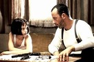

# 🔪 Leon the Professional 
>+ A 1994 English-language French action-thriller film written and directed by Luc Besson
---
\

 ---
 ### Plot
 ---

Léon is an Italian-American hitman (or "cleaner", as he refers to himself) working for a mafioso named "Old Tony" in the Little Italy neighborhood of New York City. One day, Léon meets Mathilda Lando, a lonely twelve-year-old who lives with her dysfunctional family in an apartment down the hall from Léon. But Mathilda quickly discovers that Léon is a hitman. She begs him to take care of her and to teach her his skills, as she wants to avenge the murder of her four-year-old brother 

#### [Back](./drama.md)
