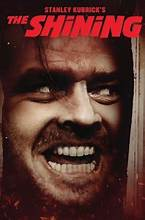

# 🪓 The Shining 
> +  The Shining, an adaptation of Stephen King’s famous novel, is a chilling exploration of the human psyche and the inherent danger of isolation

---
\
.jpg)
.jpg)
.jpg)

---
### Plot 
---
After landing a job as an off-season caretaker, Jack Torrance, an aspiring author and recovering alcoholic, drags his wife Wendy and gifted son Danny to snow-covered Colorado's secluded Overlook Hotel. However, writer's block prevents Jack from pursuing a new writing career. Everything has its time, however. First, the manager must give Jack a grand tour. Then, Mr Hallorann, the facility's aging chef, chats with Danny about rare psychic gifts. The mysterious employee also warns the boy about the cavernous hotel's abandoned rooms. Room 237, especially, is off-limits. That's all very well, but Jack is gradually losing his mind. After all, strange occurrences and blood-chilling visions have trapped the family in a silent gargantuan prison hammered by endless snowstorms. And now, incessant voices inside Jack's head demand sacrifice. However, is Jack capable of murder?