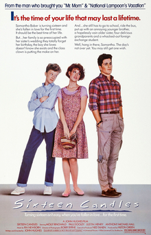

# 16 Candles 
+ Written and directed by John Hughes in his directorial debut, it was the first in a string of films Hughes would direct, centering on teenage life. 

The film follows newly 16-year-old Samantha Baker (Ringwald), who deals with a seemingly unrequited crush on high school senior Jake Ryan (Schoeffling) while also being pursued by freshman