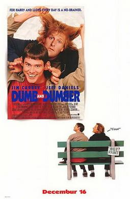

# Dumb and Dumber 
+ Dumb and Dumber is a 1994 American buddy comedy film directed by Peter Farrelly. Who cowrote the screenplay with Bobby Farrelly and Bennett Yellin. 

Two dumb but well-meaning friends from Providence, Rhode Island, who set out on a cross-country road trip to Aspen, Colorado, to return a briefcase full of money to its owner, thinking it was abandoned as a mistake, though it was actually left as a ransom.