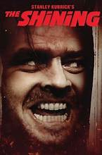

# The Shining 

+ The Shining, an adaptation of Stephen King’s famous novel, is a chilling exploration of the human psyche and the inherent danger of isolation
-------

A family heads to an isolated hotel for the winter, where a sinister presence influences the father into violence. At the same time, his psychic son sees horrifying forebodings from both the past and the future.